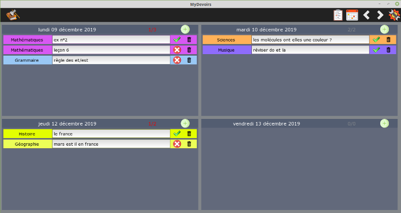
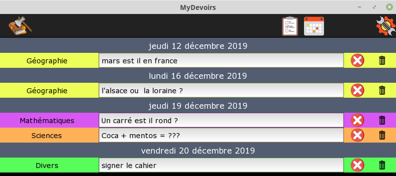

# La prise de devoirs sur ordinateur enfin simple !!!






## Pourquoi MyDevoirs ?

Mon fils a un ordinateur à l'école depuis le CM1. Nous avons essayé beaucoup de solution (rainlendar, onenote, agenda windows...), malheureusement rien de spécialement adapté pour parfaitement coller aux besoins d'un enfant. MyDevoirs a donc été développé spécialement pour lui, en accord avec ses besoins et ses exigences.

## Comment l'installer ?

Pour l'instant disponible sous Windows et Linux (Mac possible si quelqu'un le demande).

- Version Windows : [MyDevoirs.exe](https://github.com/jgirardet/mydevoirs/releases/download/0.5.0/MyDevoirs.exe) 
- Vesion Linux : [MyDevoirs](https://github.com/jgirardet/mydevoirs/releases/download/0.5.0/MyDevoirs)

	- puis sous Windows :
		- windows va vous mettre en garde car l'application n'est pas certifiée mais pas d'inquiétude, il suffit de cliquer sur `informations complémentaires` puis  `exécuter quand même`:

			 

		- Ensuite il suffit d'éxécuter le fichier est c'est parti.

	- puis sous Linux :
		- Il faut rendre le fichier executable sous en monde teminale:
		```bash
		chmod +x MyDevoirs
		```
		ou en mode graphique, par exemple sous Mint :  click droit => propiétés => permissions => Autoriser l'exécution du fichier comme un programme.


## Comment l'utiliser ?

Il y a 2 interfaces possible : Une interface  type `agenda`  qui affiche chaque jour de la semaine avec les devoirs de chaque jour, une autre type `todo list` (liste des tâches) . Il semble plus simple de noter ses devoirs dans le mode `agenda` mais plus simple de faire ses devoirs en mode `todo list`. La `todolist` n'affiche que les devoirs non encore effectués alors que l'`agenda` affiche l'intégralité des devoirs.

Il est possible de modifier les jours affichés dans `Paramètres` .

En mode `agenda` on change de semaine en cliquant sur  pour semaine suivante ou pour semaine précédante. 

### Pour ajouter un devoir:

On clique sur  et on choisit sa matière en cliquant dessus ou avec `entrée`.

La zone de texte est directement sélectionnée, pour entrer le texte correspondant.

### Pour marquer un devoir comme terminé:

On clique sur  qui devient . En mode `todo list` la ligne disparaît de l'affichage.

### Pour supprimer un devoir:

On clique sur , il faut ensuite confirmer.

## C'est un peu long de reprendre la souris à chaque fois, des raccourcis claviers se serait bien...

Les raccourcis claviers sont à utliser quand le curseur est dans une zone de texte.

 - `Ctrl+D` : (D = dupliquer) Pour créer une nouvelle ligne avec la matière en cours. Pratique quand on veut noter plusieurs choses de la même matière (par exemple leçons, exercices...).

 - `Ctrl+M` : (M = Matière) Pour changer la matière en cours. on peut se déplacer avec les `flêches` et valider son choix avec `entrée` ou la `flêche droite`.

 - `Ctrl+N` : (N = Nouveau) Pour créer une nouvel ligne, le choix des matières s'affiche, on choisit avec les `flêches` et on valide par `entrée`.

 - `Ctrl+E`: (E = effacer) Pour effacer une ligne.

